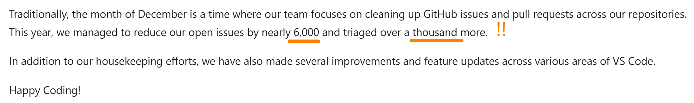

import { Aside, Badge, Card, CardGrid, Code, FileTree, Icon, LinkButton, LinkCard, Steps, TabItem, Tabs } from '@astrojs/starlight/components';
import { Image } from 'astro:assets';

What are the measures of quality in software development? This is an important question to consider as you embark on a career in computer programming.

Quality in software is a measure of these three things:

1. **Accuracy** - If the program doesn't do what it's supposed to do, then it's not of much use. Our code needs to *do things right*.
1. **Maintainability** - Most of the cost of software development is in the maintenance rather than the initial development.
1. **Efficiency** - Software is meant to make our lives easier - to speed up our productivity for whatever task we're undertaking. When it slows us down, that's a problem!

## Accuracy is Assumed

If your code does the wronge thing or if it makes incorrect or inaccurate calculations, then it's definitely of poor quality. In fact, the expectation of accuracy is one that is *assumed* that every developer should strive for.

How do we ensure accuracy in our code? One of the best ways is to make sure we have *tests* (typically *Unit Tests*) in place. In fact, a solid approach to software design is to follow Test-Driven Development (TDD).

So, why is Accuracy so important? Because it's worth money! $

## Maintainability is a Must-Do

Did you know that it costs more to maintain software than it does to create it in the first place? It's true! If Accuracy is worth $, then Maintainability is worth $$.

How do we make our code maintainable? There's lots of techniques we can use, but it can generally be summed up as *writing clean code*.

Consider, for example, the editor used by millions of software developers: **Visual Studio Code**. I've just installed the latest release (Jan 8, 2026). Here's a little comment in the release notes:

Did you catch those details in the screenshot? <q>Closing 6,000 issues and triaging over a thousand more.</q> And that was from a single release. The VS Code team puts out releases on a *monthly* basis. Because they strive to make their code Maintainable, they are able to add new features and fix bugs. That's worth 💰.

## Extra Value through Efficiency

If Accuracy is worth $, and Maintainabilty is worth $$, then what is Efficiency worth?

Well, that depends. Sometimes, efficiency is only worth pennies on the dollar. Other times, it's worth a whole lot more. It really depends on the situation.

This is why Efficiency isn't the *first* thing you should think about when working on code. Put your big efforts into Accuracy to start with. Then, right away, start making your code Maintainable. In fact, professional kitchens in restaurants are a great example in maintainability, because they follow a practice of "clean as you go". When you have these first two quality measures in place, then you are ready to address questions of efficiency in your code. But remember - efficiency isn't about making *your* life easier/better. It's about making your *end-user's* life better!

## The Takeaways

What should you take away from this little blurb on Code Quality? Simple this: Quality Matters! It comes about not by magic or learning cool techniques. It comes simply from a dedication to developing the personal and professional **discipline** of applying your skills in the best way possible.

<Aside>
    Looking for more concrete techniques in building quality software? Look for "Quality" in this site's search bar.

    - [ ] AUTHOR TODO: Write more about how things like TDD helps to build quality into our programs
</Aside>
