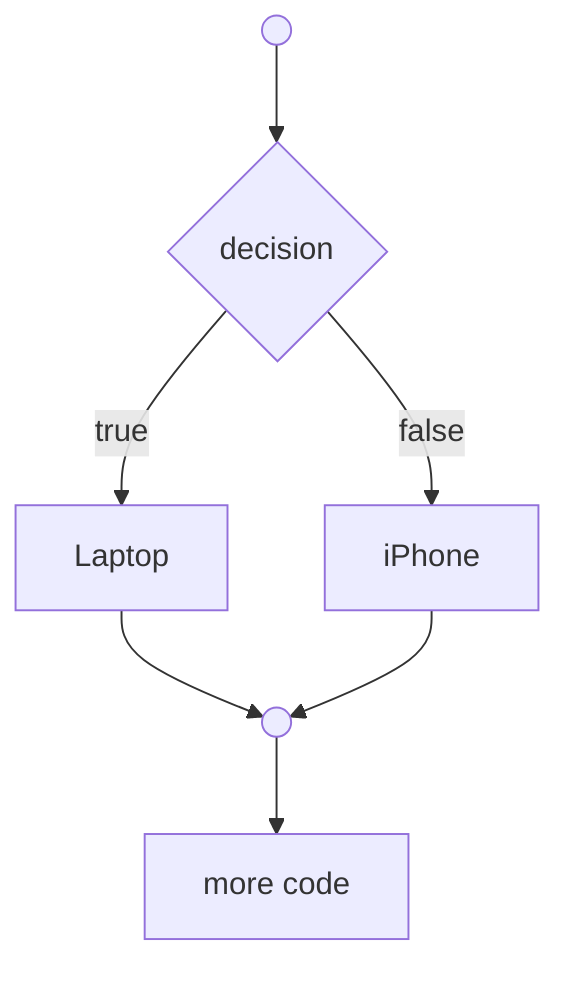

import { Aside, Badge, Card, CardGrid, Code, FileTree, Icon, LinkButton, LinkCard, Steps, TabItem, Tabs } from '@astrojs/starlight/components';
import { Image } from 'astro:assets';

import Instructor from './instructor.mdx';
import Sheild from '../../../../components/astro/Shield.astro';

<Sheild label="Assignment 1" message="In-Class Bucket" color="blue" logo="javascript" />
<Instructor minutes="65-85">
- This lesson results in approximately **150 lines of code**.
- Students type through basic `if` statements, changed values, `if/else`, independent decisions, and alternate combinations.
- The walkthrough needs time for commentary around conditions, skipped blocks, and reading program paths.
- The estimate allows extra time for slower typing and for students to predict outcomes before running the code.
</Instructor>


----

## Lecture

We're going to explore the first major flow-control structure in JavaScript: the `if` statement. We'll use simple examples to see how code can choose one path or skip a path based on a condition.

<Aside type="tip" title="Informational Lecture">
  The lecture portion should be presented as information rather than explanation. Students should be familiar with the basic concepts of if-else statements from their homework and readings before class.
</Aside>

### Flow Control and Decisions

The key to understanding if-else logic is to *follow the arrows*. When you hit a decision (the diamond), you have to evaluate the question as resulting in a **`true`** or **`false`** result.



### if/else grammar

- conditional expressions -> always get resolved as true or false
    - truthy/falsey

### Relational Operators

Students should be able to identify and distinguish these relational operators:

- `<`  &mdash; less than
- `<=` &mdash; less than or equal to
- `>`  &mdash; greater than
- `>=` &mdash; greater than or equal to
- `==` &mdash; is equal to
- `!=` &mdash; is not equal to

Each comparison produces a boolean result that can guide program flow.

<Aside type="note" title="Skip for now...">
  You can skip the **strict** equality/inequality operators. They will be addressed in the next lesson.
</Aside>

### Truthy and Falsy Values

JavaScript conditions are not limited to literal `true` and `false` values. Some values behave as true, and some values behave as false, when they are used in conditions.

<Aside type="note" title="Truthy and Falsy">
  This is a first look at truthy and falsy values.

  An empty string behaves as false in a condition. A non-empty string behaves as true. Objects behave as true when they exist.

  We do not need students to memorize every truthy/falsy value today, but they should notice that conditions can be guided by more than literal booleans.
</Aside>

## Demo Walkthrough

### 💫 Setup

import BucketSetup from '../../../../components/astro/BucketSetup.astro';

<BucketSetup lessonNumber="7" folder="~/inclass/07/" file="demo.js" lang="js" />

### If Statement

An <a href="https://developer.mozilla.org/docs/Web/JavaScript/Reference/Statements/if...else" target="_blank">`if` statement</a> lets JavaScript run a block of code only when a condition is true.

<Steps>
1. Open the `~/inclass/07/demo.js` file in VS Code and then run it in Node's "watch" mode. You should see the following output.

    ```ps title="Output"
    Lesson 07 demo.js has loaded
    ===============================

    ```

    Our starter script confirms that the file is running.

    ```js title="~/inclass/07/demo.js"
      displayHeading('Lesson 07 demo.js has loaded', "=");
      console.log();

      /**
      * Display a heading in the console with a leading blank line.
      * @param {string} text The heading text
      * @param {string?} marker The underline character (defaults to `-`)
      */
      function displayHeading(text, marker = "-") {
        console.log(); // Blank line before the heading
        console.log(text);
        console.log(marker.repeat(text.length));
      }

      // Begin Lesson 08
    ```

1. Add the first section and create two values for a battery check.

    ```diff lang="js" title="~/inclass/07/demo.js"
      // Begin Lesson 07
    +
    + displayHeading('Basic if statement');
    + 
    + let batteryPercent = 64;
    + let lowBatteryWarning = 20;
    ```

    The scenario will be simple: if the battery is above the warning level, the device can keep running.

1. (📍 `checkBattery`) Add an `if` statement that checks the battery percentage. To make it re-usable, we'll wrap it in a function. Then we'll call it to see the results.

    ```diff lang="js" title="~/inclass/07/demo.js" "if" "batteryPercent > lowBatteryWarning"
      let batteryPercent = 64;
      let lowBatteryWarning = 20;
    +
    + function checkBattery() {
    +     if (batteryPercent > lowBatteryWarning)
    +         console.log('Battery level is acceptable');
    +     console.log(`Battery percent: ${batteryPercent}%`);
    +     console.log();
    + }
    + 
    + checkBattery();
    ```

    The `if` keyword indicates the following parenthetical code is checking a *condition*. The condition is the expression inside the parentheses (which is why it's called a **conditional expression**). The block is the code inside the curly braces.

    <Aside type="note" title="Condition and Block">
      This is a useful vocabulary pause.

      The **condition** must produce a true/false kind of answer. The **block** is the group of statements that runs only when the condition is true.

      In this example, `batteryPercent > lowBatteryWarning` is the condition.
    </Aside>
1. We can check that our if statement is working correctly by depleting the battery and calling `checkBattery()` one more time.

    ```diff lang="js" title="~/inclass/07/demo.js"
      checkBattery();
    + 
    + batteryPercent = 12;
    + checkBattery();
    ```

1. (📍 `checkBattery`) Let's output an additional message when the battery has enough charge.

    ```diff lang="js" title="~/inclass/07/demo.js"
      function checkBattery() {
    -     if (batteryPercent > lowBatteryWarning)
    +     if (batteryPercent > lowBatteryWarning) {
              console.log('Battery level is acceptable');
    +         console.log('The device can keep running');
    +     }
          console.log(`Battery percent: ${batteryPercent}%`);
          console.log();
      }
    ```

    Notice that, in order to have both statements appear under the `true` condition, we now have to wrap them in a pair of curly braces. This is called a **statement block**.

    <Aside type="tip" title="Always use curly braces?">
      If you're uncertain about the distinction between a *single statement* and a *statement block*, you can choose to always wrap your conditional code inside curly braces.

      A **statement block** can contain zero or more statements.
    </Aside>
</Steps>

> ```ps
> git add .
> git commit -m "If Statement"
> ```

### If-Else Statement

An if-else statement allows us to provide **mutually exclusive** paths of logic. The *`true`* side of an `if` statement must always exist. We can also specify what to do when the result of the condition is *`false`* - an *alternate path* of logic. We add it by including the optional `else` clause to the `if` statement.

<Steps>
1. We'll create a booking example with available seats, requested seats, and a booking fee.

    ```diff lang="js" title="~/inclass/07/demo.js"
      batteryPercent = 12;
      checkBattery();
    + 
    + displayHeading("Basic if-else statement");
    ```

1. (📍 `bookSeats`) We'll add a function called `bookSeats()` which will check if there is enough room in the theatre to reserve a group of people.

    ```diff lang="js" title="~/inclass/07/demo.js" "else"
      displayHeading("Basic if-else statement");
    + 
    + function bookSeats(seats) {
    +     let fee = 0;
    +     if(theatreSeats >= reservedSeats + seats) {
    +         console.log('Booking confirmed.');
    +         reservedSeats += seats;
    +         fee = seats * 12.50;
    +         console.log(`${seats} seats booked for $ ${fee.toFixed(2)}`);
    +     } else {
    +         console.log("Booking declined.");
    +         console.log(`Unable to book ${seats} seats; not enough seats available.`);
    +     }
    +     console.log();
    +     return fee;
    + }
    ```

    We declare `fee` variable with an **initial value** because only the `true` side of our if-else computes the fee for seat reservations.

1. Let's test our our if-else statement by setting up some variables and calling the function. Append the following to your existing code

    ```diff lang="js" title="~/inclass/07/demo.js"
    + let theatreSeats = 25, reservedSeats = 5, groupAFee, groupBFee;
    + groupAFee = bookSeats(7); // returns 87.50
    + 
    + groupBFee = bookSeats(20); // returns 0
    ```

1. Let's add a check to see if our second booking attempt failed. If it failed, we'll attempt booking a smaller group.

    ```diff lang="js" title="~/inclass/07/demo.js"
      groupBFee = bookSeats(20); // returns 0
    + 
    + if(groupBFee == 0) {
    +     groupBFee = bookSeats(10);
    + }
    + console.log(`${theatreSeats - reservedSeats} seats are still available.`);
    + console.log();
    ```

    Only one of these branches runs. If the condition is true, the `if` block runs. If the condition is false, the `else` block runs.
</Steps>

> ```ps
> git add .
> git commit -m "If-Else Statement"
> ```

### Boolean Variables and "Truthy"/"Falsey" Conditions

Because the **conditional expression** of an if-else statement has to result in a `true` or `false`, we can write that conditional expression in a simpler form when we have a **boolean** variable.

<Steps>
1. We'll expand on the theatre scenario by determining if the play will continue or not. Let's start with a heading.

    ```diff lang="js" title="~/inclass/07/demo.js"
      console.log();
    + 
    + displayHeading('Booleans and "Truthy"/"Falsey" Conditions');
    ```

1. Boolean variables make our conditional expressions simpler to read and reason about, especially if the variable is clearly named.

    ```diff lang="js" title="~/inclass/07/demo.js"
      displayHeading('Booleans and "Truthy"/"Falsey" Conditions');
    +
    + let isEmpty = true;

    + if(isEmpty) {
    +     console.log('Play cancelled - no reservations');
    + } else {
    +     console.log('The play is on!');
    + }
    ```

    There is no need to *compare* `isEmpty` to some value because the variable already holds a boolean value. In other words, it would be redundant to write `if(isEmpty == true)`.

1. Hard-coding a `true` value for the variable is not as interesting as assigning it the result of a *conditional expression*.

    ```diff lang="js" title="~/inclass/07/demo.js" "reservedSeats == 0"
    - let isEmpty = true;
    + let isEmpty = reservedSeats == 0;
    ```

1. (📍 `announcePlayStatus`) JavaScript conditional expressions are not restricted to explicit `true` or `false` results. JavaScript supports "truthy" and "falsey" conditional expressions in if statements.

    To make this easier to demonstrate, we'll create a function we can call more than once.

    ```diff lang="js" title="~/inclass/07/demo.js"
    + function announcePlayStatus(){
    +     if (reservedSeats)
    +         console.log(`The play is on! ${reservedSeats} in the audience.`);
    +     else
    +         console.log('Play cancelled - no reservations');
    + }
    + 
    + announcePlayStatus();
    ```

    <Aside type="note" title="Falsey Values">
      In JavaScript, all of the following are regarded as equivalent to 'false' in a conditional expression.

      - `undefined`
      - `null`
      - `0` - the number zero
      - `''` - an empty string
      - `{}` - an empty object
    </Aside>

1. To illustrate the falsey result, let's set the `reservedSeats` to zero.

    ```diff lang="js" title="~/inclass/07/demo.js"
      announcePlayStatus();
    + 
    + reservedSeats = 0; // everybody cancelled
    + announcePlayStatus();
    + 
    + console.log();
    ```

</Steps>

> ```ps
> git add .
> git commit -m "Booleans and truthy/falsey"
> ```

### Nested If-Else Statements

If-else statements can be nested, allowing us to handle logic problems that are more complex and varied. We'll examine the possibilities by determining the type of triangle based on the length of its sides.

<Steps>
1. Let's create our heading. Optionally, you can add a `console.clear()` if you want to declutter the output.

    ```diff lang="js" title="~/inclass/07/demo.js"
      console.log();
    + 
    + displayHeading('Nested If-Else');
    ```

1. (📍 `reportTriangle`) Let's gradually build a function to report a triangle's type (right-angle, obtuse, acute). We'll start with the most straight-forward approach: checking the supplied diagonal with what the hypotenuse would be if it's a right-angled triangle.

    ```diff lang="js" title="~/inclass/07/demo.js"
      displayHeading('Booleans and "Truthy"/"Falsey" Conditions');
    + 
    + function reportTriangle(base, height, diagonal) {
    +     let triangleType;
    +     // It only has to be close for our purposes.
    +     let hypotenuse = Math.round(Math.hypot(base, height) * 1000) / 1000;
    +     if(diagonal == hypotenuse) {
    +         triangleType = 'right-angle';
    +     
    +     console.log(`The triangle has side lengths of ${base}, ${height} and ${diagonal}`);
    +     console.log(`Classification: ${triangleType} triangle`);
    +     console.log();
    + }
    ```

1. Let's try calling it with sample dimensions that are known to product a right-angle triangle. Append the following code.

    ```diff lang="js" title="~/inclass/07/demo.js"
    + 
    + reportTriangle(12, 35, 37);
    ```

1. We can add two other sets of dimensions. Can you guess the triangle type based on the dimensions alone?

    ```diff lang="js" title="~/inclass/07/demo.js"
      reportTriangle(12, 35, 37);
    + reportTriangle(7, 5, 17);
    + reportTriangle(5, 7, 8);
    ```

1. (📍 `reportTriangle`) Let's revisit our function and add in our nested if-else statement. Logically, the nested decision should appear on the `else` side of our original decision.

    ```diff lang="js" title="~/inclass/07/demo.js"
      function reportTriangle(base, height, diagonal) {
          let triangleType;
          // It only has to be close for our purposes.
          let hypotenuse = Math.round(Math.hypot(base, height) * 1000) / 1000;
          if(diagonal == hypotenuse) {
              triangleType = 'right-angle';
    +     } else {
    +         if(diagonal > hypotenuse) {
    +             triangleType = 'acute';
    +         } else {
    +             triangleType = 'obtuse';
    +         }
    +     }
          
          console.log(`The triangle has side lengths of $ base}, ${height} and ${diagonal}`);
          console.log(`Classification: ${triangleType} triangle`);
          console.log();
      }
    ```

1. As a challenge, can you expand on the logic to detect other characteristics of the triangle?

    - Equilateral triangles have three equal sides
    - Isoceles triangles have two equal sides
    - Scalene triangles have no equal sides
    - Can scalene triangles also be right triangles?
</Steps>

> ```ps
> git add .
> git commit -m "Nested If-Else Statements"
> ```

### Demo Verification

To verify that your demo has the correct items, add the following to the end of your script file. These will be checked in your bucket assignment's automated tests.

```js title="~/inclass/07/demo.js"
export { checkBattery, bookSeats, announcePlayStatus, reportTriangle }
```

> ```ps
> git add .
> git commit -m "Finish intro to arrays"
> ```

----

## Conclusion

The `if` statement lets a program make decisions. The condition chooses whether a block runs, and `else` gives us an alternate path when the condition is false.

### Homework

We haven't tried out *all* of the relational operators. Expand on the following code so that you demonstrate testing all the relational operations.

```js title="TBD"
TBD
```


<Aside type="tip" title="Understanding JavaScript 👀">
  The key habit in this lesson is to read flow-control code as a **path** through the program.

  Ask: What condition is being checked? Which block runs when it is true? What happens when it is false? Are two decisions connected, or are they independent?
</Aside>
